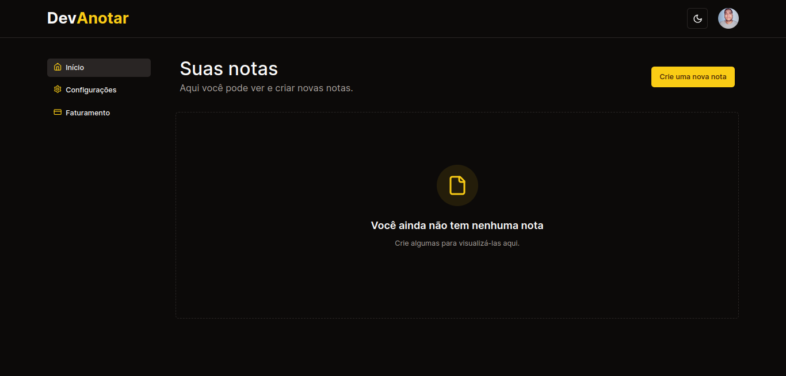
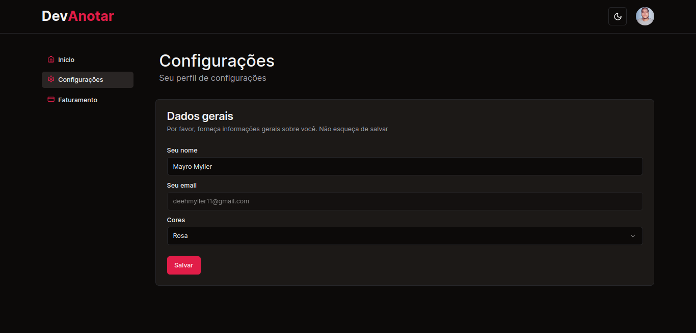
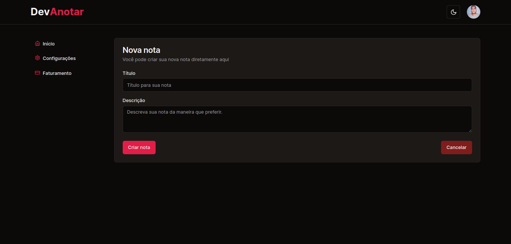

<h1 align="center">
	<span>
    Dev<span style="color:#fb1">Anotar</span>
  </span>
  <br />
</h1>

## Descrição Breve

Uma aplicação FullStack simples, que utiliza autenticação com Kinde Auth, Supabase, Shadcn/ui, TailwindCSS, Stripe (pagamento), NextJS e Prisma ORM.

## Índice

1. [Motivação](#motivação)
2. [Demonstração](#demonstração)
3. [Funcionalidades](#funcionalidades)
4. [Instalação](#instalação)
5. [Como Usar](#como-usar)
6. [Configurar .env](#configurar-env)
7. [Stack](#stack)
8. [Estrutura do Projeto](#estrutura-do-projeto)
9. [Contribuição](#contribuição)
10. [Licença](#licença)
11. [Contato](#contato)
12. [Agradecimentos](#agradecimentos)

## Motivação

Este projeto foi criado para aprimorar conhecimentos em desenvolvimento de aplicações fullstack, integrando tecnologias como meio de pagamento (Stripe), ORM (Prisma) e banco de dados (Supabase). Ele utiliza diversas tecnologias de ponta, amplamente adotadas por empresas que buscam escalar seus produtos, tornando-o uma base valiosa para a criação de projetos maiores e mais robustos.

## Demonstração

- Página inicial da aplicação ao fazer login:



- Página de configurações de perfil:



- Criar uma nova nota:



## Funcionalidades

- Editar perfil e preferencias
- Alterar cores do tema da aplicação
- Criar notas
- Editar notas
- Deletar notas
- Listar notas
- Autenticação com Kinde
- Integração com pagamento para poder criar notas

## Instalação

### Pré-requisitos

- `Node.js` versão 18 ou superior
- Conta no [Kinde](https://kinde.com/), [Supabase](https://supabase.com/) e [Stripe](https://stripe.com/br)

### Passos para Instalação

1. Clone o repositório:

   ```bash
   git clone https://github.com/mayromyller/devanotar.git
   cd devanotar
   ```

2. Instale as dependências:

   ```bash
   pnpm install
   ```

   ou outro gerenciador de pacote de sua preferência.

3. Configure as variáveis de ambiente. Veja a seção [Configurar .env](#configurar-env) para mais detalhes.

## Como Usar

1. Execute o servidor de desenvolvimento:

   ```bash
   pnpm dev
   ```

2. Abra a aplicação em `http://localhost:3000`.

3. Faça autenticação e comece a utilizar.

## Configurar .env

Crie um arquivo `.env` na raiz do projeto e adicione as seguintes variáveis:

```env
KINDE_CLIENT_ID=
KINDE_CLIENT_SECRET=
KINDE_ISSUER_URL=

KINDE_SITE_URL=
KINDE_POST_LOGOUT_REDIRECT_URL=
KINDE_POST_LOGIN_REDIRECT_URL=

DATABASE_URL=

DIRECT_URL=

STRIPE_SECRET_KEY=

STRIPE_PRICE_ID=
STRIPE_WEBHOOK_SECRET=
```

## Stack

- **Frontend**: NextJS 14, TailwindCSS, Shadcn/ui
- **Backend**: Node.js, Prisma, Supabase
- **Autenticação**: Kinde Auth
- **Pagamento**: Stripe

## Estrutura do Projeto

```
.
├── prisma
│   └── schema.prisma
├── src
│   ├── app
│   │   ├── payment
│   │   │   ├── success.tsx
│   │   │   └── cancelled.tsx
│   │   ├── dashboard
│   │   │   ├── billing.tsx
│   │   │   ├── index.tsx
│   │   ├── new
│   │   │   ├── [id].tsx
│   │   │   └── index.tsx
│   │   └── settings.tsx
│   ├── components
│   │   └── ui
│   └── ...
└── ...
```

## Contribuição

Contribuições são bem-vindas! Para contribuir, siga estas etapas:

1. Abra uma issue para discutir o que você gostaria de mudar.
2. Faça um fork do repositório.
3. Crie uma nova branch (`git checkout -b feature/descrição-da-feature`).
4. Faça as alterações desejadas.
5. Envie suas mudanças (`git commit -am 'Adiciona nova feature'`).
6. Faça um push para a branch (`git push origin feature/descrição-da-feature`).
7. Crie um novo Pull Request.

## Licença

Este projeto está licenciado sob a Licença MIT. Veja o arquivo [LICENSE](LICENSE) para mais detalhes.

## Contato

- [LinkedIn](https://www.linkedin.com/in/mayromyller/)
- [GitHub](https://github.com/mayromyller)
- Email: [mayro.mmdev@gmail.com](mailto:mayro.mmdev@gmail.com)
